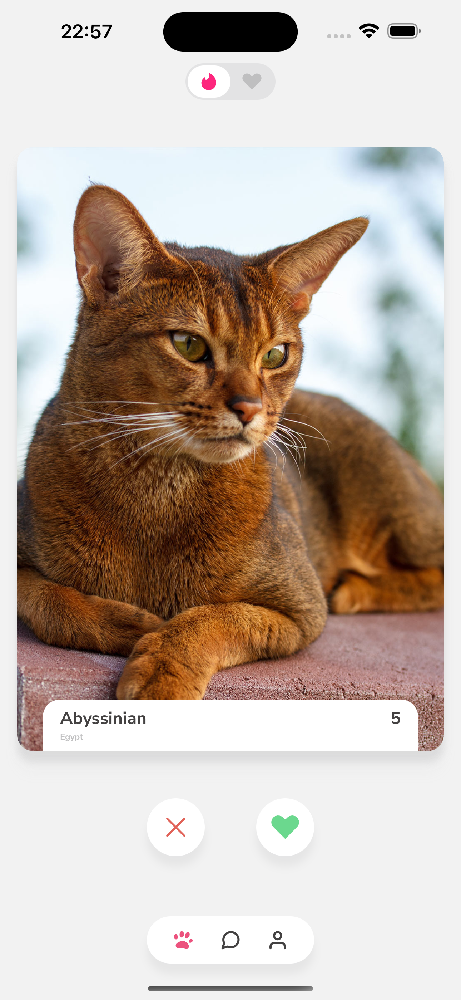

# Pawnder 🐾



Pawnder is a modern mobile application built with React Native and Expo that helps pet lovers connect with their perfect furry companions. Whether you're looking to adopt a new pet or find the right match for your lifestyle, Pawnder makes the process easy and enjoyable.

## Features

- 🐶 Browse adorable pets available for adoption
- ❤️ Swipe right to like, left to pass
- 📱 Beautiful, intuitive UI with smooth animations
- 📱 Cross-platform support (iOS & Android)

## Prerequisites

Before you begin, ensure you have the following installed:

- Node.js (v16 or later)
- npm (comes with Node.js)
- Expo CLI (`npm install -g expo-cli`)
- Xcode (for iOS development)
- Android Studio (for Android development)

## Getting Started

1. **Clone the repository**

   ```bash
   git clone [your-repository-url]
   cd Pawnder
   ```

2. **Install dependencies**

   ```bash
   npm install
   ```

3. **Set up environment variables**
   Copy the example environment file and update it with your configuration:

   ```bash
   cp .env.example .env
   ```

   Edit the `.env` file with your API keys and other environment-specific settings.

4. **Run prebuild (required for native modules)**

   ```bash
   npm run prebuild
   ```

5. **Start the development server**

   ```bash
   npx expo start
   ```

6. **Run the app**
   - For iOS:
     ```bash
     npm run ios
     ```
   - For Android:
     ```bash
     npm run android
     ```
   - Or scan the QR code with the Expo Go app on your device

## Environment Variables

The `.env` file contains your environment-specific configuration. Here's what you need to set up:

```
# API Configuration
API_BASE_URL=your_api_base_url
API_KEY=your_api_key

# App Configuration
APP_NAME=Pawnder
ENVIRONMENT=development

# Optional: Analytics and Monitoring
SENTRY_DSN=your_sentry_dsn
GOOGLE_ANALYTICS_ID=your_ga_id
```

Make sure to never commit your `.env` file to version control. It's already included in `.gitignore`.

## Project Structure

```
Pawnder/
├── app/                 # Main application code
│   ├── (tabs)/          # Tab navigation screens
│   └── _layout.tsx      # Root layout
├── assets/              # Static assets (images, fonts, etc.)
├── components/          # Reusable UI components
├── constants/           # App-wide constants
├── hooks/               # Custom React hooks
├── services/            # API and service layer
├── types/               # TypeScript type definitions
└── utils/               # Utility functions
```

## Contributing

We welcome contributions! Please feel free to submit a Pull Request.

## License

This project is licensed under the MIT License - see the [LICENSE](LICENSE) file for details.

## Support

For support, please open an issue in the repository or contact the maintainers.
